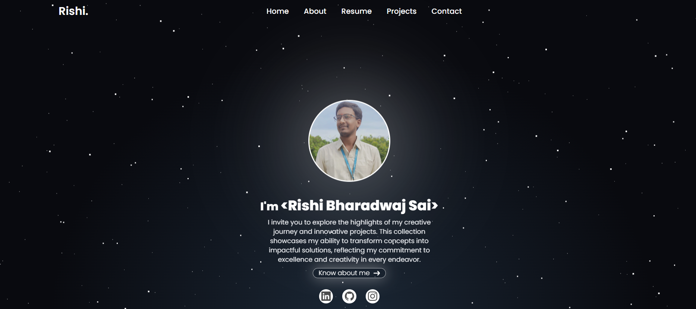

# 🌟 Rishi Bharadwaj Sai: Personal-Portfolio

Welcome to my portfolio project repository! This is where creativity meets technology. Through this project, I aim to showcase my journey as an Electronics and Computer Engineering student, highlighting my passion for innovation, coding, and problem-solving.

## 🚀 Project Overview

This portfolio is more than just a personal website—it's a digital narrative of my academic and technical journey. From competitive coding challenges to innovative projects, this space is a reflection of the skills, knowledge, and creativity I've developed over the years.

### 🎨 Features

- **Dynamic Hero Section**: A captivating introduction that sets the tone for the portfolio.
- **Interactive Projects Showcase**: Dive into my projects, each carefully selected to demonstrate different aspects of my skill set.
- **Responsive Design**: A mobile-first approach ensures that the portfolio looks stunning on any device.
- **Fluid Animations**: Smooth transitions and animations to enhance user experience.
- **Structured Content**: Clear sections for About Me, Projects, and Contact, making it easy to navigate.

### 🛠️ Technologies Used

- **Astro**: Leveraging the power of Astro for static site generation and seamless component integration.
- **Flowbite**: Utilized Flowbite for responsive UI components and prebuilt designs.

### 🌍 Live Demo

Check out the live version of my portfolio: [rishibharadwajsai.vercel.app](https://rishibharadwajsai.vercel.app/)

### 🚧 Future Enhancements

- **Blog Integration**: Sharing my thoughts on technology, coding, and more.
- **Project Filtering**: Enhanced project section with filtering capabilities based on technology used.
- **Dark Mode**: Implementing a dark mode for improved readability and aesthetics.

### 🤝 Contributing

Feel free to fork this repository, open issues, or submit pull requests. Let's collaborate and create something amazing!

# Astro Starter Kit: Basics

```sh
npm create astro@latest -- --template basics
```

[](https://stackblitz.com/github/withastro/astro/tree/latest/examples/basics)
[](https://codesandbox.io/p/sandbox/github/withastro/astro/tree/latest/examples/basics)
[](https://codespaces.new/withastro/astro?devcontainer_path=.devcontainer/basics/devcontainer.json)

> 🧑‍🚀 **Seasoned astronaut?** Delete this file. Have fun!


## 🚀 Project Structure

Inside of your Astro project, you'll see the following folders and files:

```text
/
├── public/
│   └── favicon.svg
├── src/
│   ├── components/
│   │   └── Card.astro
│   ├── layouts/
│   │   └── Layout.astro
│   └── pages/
│       └── index.astro
└── package.json
```

Astro looks for `.astro` or `.md` files in the `src/pages/` directory. Each page is exposed as a route based on its file name.

There's nothing special about `src/components/`, but that's where we like to put any Astro/React/Vue/Svelte/Preact components.

Any static assets, like images, can be placed in the `public/` directory.

## 🧞 Commands

All commands are run from the root of the project, from a terminal:

| Command                   | Action                                           |
| :------------------------ | :----------------------------------------------- |
| `npm install`             | Installs dependencies                            |
| `npm run dev`             | Starts local dev server at `localhost:4321`      |
| `npm run build`           | Build your production site to `./dist/`          |
| `npm run preview`         | Preview your build locally, before deploying     |
| `npm run astro ...`       | Run CLI commands like `astro add`, `astro check` |
| `npm run astro -- --help` | Get help using the Astro CLI                     |

## 👀 Want to learn more?

Feel free to check [our documentation](https://docs.astro.build) or jump into our [Discord server](https://astro.build/chat).
